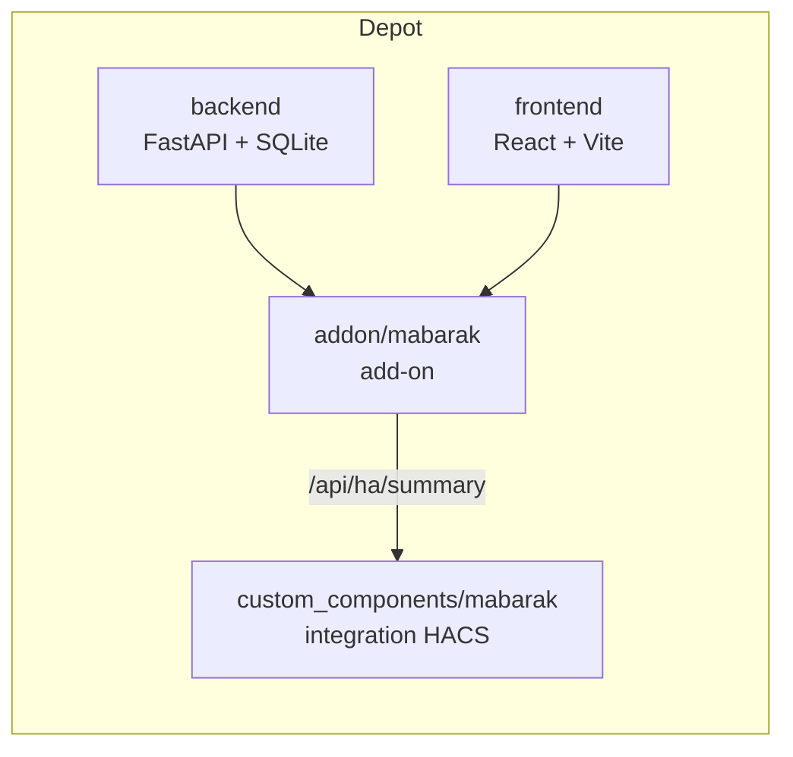

# MaBarak

Application locale de gestion et d'entretien de la maison, pour Home Assistant.

Elle centralise les équipements, les éléments de construction, les entretiens récurrents,
l'historique des interventions, les documents, les garanties et les coûts. Le principe : ouvrir
la fiche d'un appareil et savoir immédiatement ce que c'est, où il est, quand il a été installé
et entretenu, ce qui a été réparé, combien il a coûté, où sont la facture et la notice, et s'il
est encore sous garantie.

**Local-first.** Aucune donnée ne quitte votre machine. Pas de cloud, pas de compte, pas de
télémétrie.

> **État du projet : 0.2.0 — fiche équipement.**
> Maison, lieux en arbre, fiches d'appareils, entretiens (Fait / préciser) et tableau de bord.
> Les documents (PDF, factures) et les éléments de construction ne sont pas encore dans l'interface.

## Ce dépôt contient deux produits

C'est la première chose à comprendre avant de s'y retrouver. Le dépôt est à la fois un **dépôt
d'add-ons Home Assistant** et un **dépôt d'intégration HACS**, et les deux artefacts se
publient ensemble.

- `repository.yaml` déclare le dépôt d'add-ons. Home Assistant y trouve l'add-on dans
  [`addon/mabarak/`](addon/mabarak/).
- `hacs.json` déclare le dépôt d'intégration. HACS y trouve l'intégration dans
  [`custom_components/mabarak/`](custom_components/mabarak/).

Les deux mécanismes coexistent sans conflit. Le raisonnement, et la contrainte qui en découle
sur le versionnement, sont dans
[ADR-0005](docs/adr/0005-monodepot-addon-et-hacs.md).



L'add-on porte toute l'application : base de données, documents, API, interface. L'intégration
ne stocke rien ; elle projette l'état de la maison en entités Home Assistant, pour les rendre
utilisables dans les automatisations et les notifications.

## Structure

- [`docs/`](docs/) — architecture, modèle de données et décisions. **À lire en premier.**
  - [`ARCHITECTURE.md`](docs/ARCHITECTURE.md) — architecture technique et contraintes d'ingress
  - [`DATA_MODEL.md`](docs/DATA_MODEL.md) — modèle de données commenté
  - [`schema.sql`](docs/schema.sql) — schéma SQL exécutable, qui fait référence
  - [`adr/`](docs/adr/) — décisions structurantes et options écartées
- [`addon/mabarak/`](addon/mabarak/) — configuration de l'add-on, Dockerfile, services
  s6-overlay, nginx
- [`backend/`](backend/) — API FastAPI, SQLite, migrations Alembic
- [`frontend/`](frontend/) — interface React servie dans le panneau latéral
- [`custom_components/mabarak/`](custom_components/mabarak/) — intégration Home Assistant
- [`scripts/stage-addon.sh`](scripts/stage-addon.sh) — prépare les artefacts pour le build de
  l'add-on

## Installation

Voir [la documentation de l'add-on](addon/mabarak/DOCS.md). En résumé : ajoutez
`https://github.com/k69sknk/myhome` comme dépôt d'add-ons, installez MaBarak, démarrez-le,
puis ajoutez l'intégration via HACS depuis le même dépôt.

## Développement

### Prérequis

- **Python 3.13.** Le Python du système macOS est en 3.9, et Alpine ne fournit que 3.12 :
  l'image de l'add-on utilise donc Debian trixie, seule base Home Assistant offrant 3.13.
  `brew install python@3.13`
- Node 22 et npm 10
- Docker, pour construire l'image de l'add-on

### Backend et frontend

```bash
# Backend, sur le port 8000
cd backend
python3.13 -m venv .venv && source .venv/bin/activate
pip install -e ".[dev]"
MABARAK_DATA_DIR=./.data uvicorn mabarak_api.main:app --reload --port 8000

# Frontend, sur le port 5173, qui relaie /api vers le backend
cd frontend
npm install
npm run dev
```

Détails dans [`backend/README.md`](backend/README.md) et
[`frontend/README.md`](frontend/README.md).

### Construire l'image de l'add-on

Le builder Home Assistant utilise le répertoire de l'add-on comme contexte de build, qui ne peut
donc pas atteindre `backend/` ni `frontend/`. Les artefacts sont stagés au préalable :

```bash
./scripts/stage-addon.sh   # regenerer addon/mabarak/pkg et www, puis les committer
docker build -t mabarak:dev \
  --build-arg BUILD_FROM=ghcr.io/home-assistant/amd64-base-debian:trixie \
  addon/mabarak
```

### Vérifications

```bash
sqlite3 /tmp/check.db < docs/schema.sql    # le schema doit s'executer
cd backend  && pytest && ruff check . && mypy
cd frontend && npm run build
```

La CI rejoue tout cela, plus `hassfest`, la validation HACS, le lint de l'add-on et le build de
l'image sur amd64 et aarch64.

## Le piège à connaître : le chemin de base d'ingress

Home Assistant sert l'add-on sous `/api/hassio_ingress/<token>/`, un préfixe qui change à chaque
instance et à chaque redémarrage. C'est la cause de la quasi-totalité des add-ons ingress qui
affichent une page blanche.

Trois mécanismes le résolvent ensemble et doivent rester cohérents : `base: './'` dans
`vite.config.ts`, la balise `<base href="__MABARAK_BASE__">` dans `index.html` que le backend
remplace à partir de l'en-tête `X-Ingress-Path`, et `src/base-path.ts` qui en déduit le
`basename` du routeur. Le marqueur est dupliqué dans ces trois fichiers ; la CI et les tests du
backend échouent si la chaîne se rompt.

Détails dans [`docs/ARCHITECTURE.md`](docs/ARCHITECTURE.md), section 4.

## Nom du produit

`MaBarak` est le nom retenu pour l'instant. Les points de renommage restent listés dans
[`docs/ARCHITECTURE.md`](docs/ARCHITECTURE.md). Le `DOMAIN` de l'intégration (`mabarak`)
ne pourra plus changer après la première publication sans casser les installations existantes.

## Licence

MIT. Voir [LICENSE](LICENSE).
