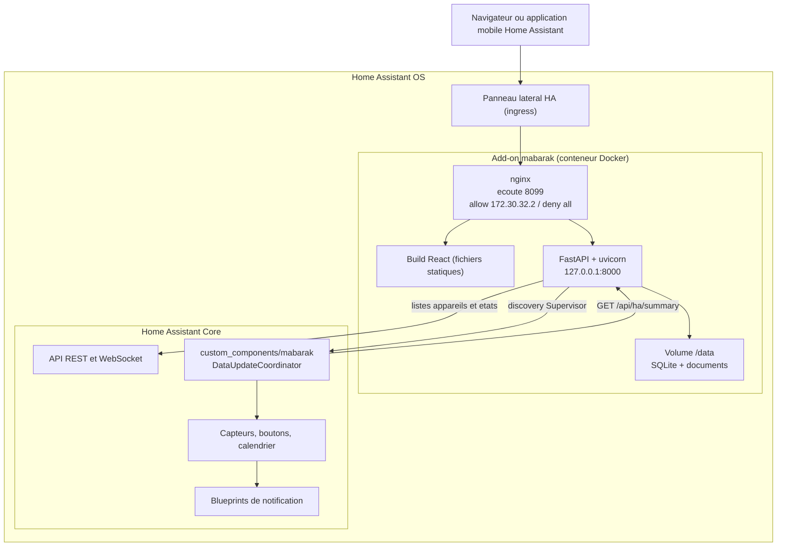
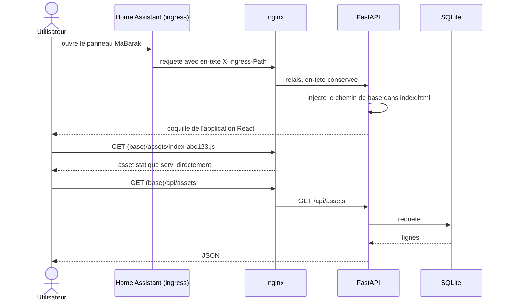
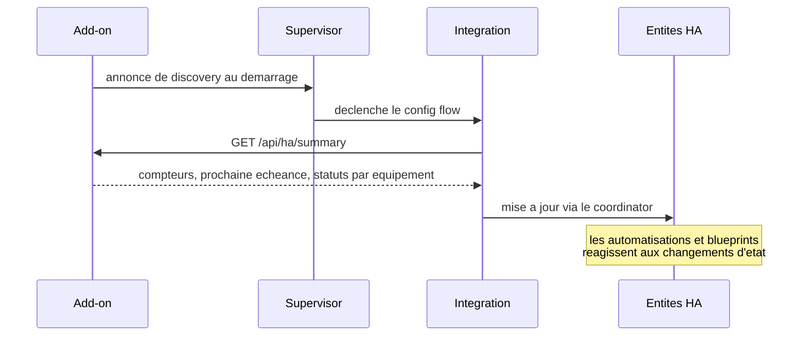

# Architecture — MaBarak

> Application locale de gestion et d'entretien de la maison, pensée pour Home Assistant.
>
> Ce document décrit l'architecture technique retenue. Le modèle de données détaillé est dans
> [DATA_MODEL.md](DATA_MODEL.md), et les décisions structurantes sont justifiées une par une
> dans [adr/](adr/).

`MaBarak` est le nom retenu pour l'instant ; il est centralisé
dans une constante unique par composant (voir [Renommage du produit](#renommage-du-produit)).

## 1. Objectif et contraintes

L'application centralise tout ce qui concerne une maison : lieux, équipements, éléments de
construction, entretiens récurrents, interventions, problèmes, documents, garanties et coûts.
Le principe fondateur est qu'un utilisateur puisse ouvrir la fiche d'un équipement et savoir
immédiatement ce que c'est, où il est, quand il a été installé, entretenu, réparé, combien il
a coûté, où sont la facture et la notice, s'il est sous garantie et ce qu'il faudra faire.

Trois contraintes non négociables découlent du cahier des charges :

- **Local-first.** Aucune donnée personnelle (nom, adresse, factures, documents) n'est envoyée
  vers un serveur tiers. Tout reste sur la machine de l'utilisateur.
- **Intégration Home Assistant de premier ordre.** L'application doit exposer des entités et
  permettre des notifications et des automatisations, pas seulement afficher une interface.
- **Pas de cloud obligatoire.** L'application doit être pleinement fonctionnelle hors ligne.

Cible de déploiement : **Home Assistant OS**. Les add-ons y sont disponibles, ce qui ouvre
l'option d'architecture retenue ci-dessous.

## 2. Architecture retenue : hybride add-on + intégration

L'application est découpée en deux artefacts installés côte à côte :

- un **add-on** qui porte l'intégralité de l'application (API, base de données, stockage des
  documents, interface web) ;
- une **intégration custom** légère, distribuée via HACS, qui projette les données de l'add-on
  dans Home Assistant sous forme d'entités.



### Pourquoi ce découpage

L'add-on apporte ce qu'une intégration seule ne peut pas offrir : un conteneur Docker avec son
propre volume persistant, donc une vraie base relationnelle interrogeable et un répertoire de
fichiers pour les documents. L'intégration apporte ce qu'un add-on seul ne peut pas offrir : des
entités dans le registre de Home Assistant, exploitables dans les automatisations, les tableaux
de bord Lovelace et les notifications.

### Options écartées

**Intégration custom pure (HACS uniquement).** Une intégration stocke ses données dans
`.storage`, sous forme de JSON chargé intégralement en mémoire. Il n'y a pas de requêtes, pas
de jointures, pas d'index, et pas de mécanisme prévu pour stocker des fichiers utilisateur.
Toute l'interface devrait être réécrite en Lit/TypeScript dans un panel frontend custom. Pour
un modèle qui comporte une dizaine d'entités reliées, un historique, des coûts agrégés et des
documents, c'est un mauvais outil. Écartée.

**Add-on seul.** Simple et rapide à construire, mais l'application resterait une île : aucune
entité dans Home Assistant, donc aucune notification native, aucune automatisation, aucune
carte Lovelace. Les sections 21 et 22 du cahier des charges en font une exigence explicite.
Écartée.

**Application autonome d'abord, intégration ensuite.** Reporte à plus tard le seul aspect qui
justifie de construire dans l'écosystème Home Assistant plutôt qu'ailleurs. Écartée.

### Ce que l'architecture hybride coûte

Deux artefacts à versionner et à publier ensemble, et un point de couplage à maintenir : le
contrat de l'endpoint `/api/ha/summary`. C'est un coût réel mais borné, contre un gain
structurel sur la durée de vie du projet.

## 3. Composants

### 3.1 Add-on `mabarak`

Conteneur Docker basé sur les images de base Home Assistant, avec `s6-overlay` pour la
supervision des processus. Deux services longue durée :

- `nginx` : filtre les adresses IP, sert directement les assets hashés du frontend et relaie
  tout le reste vers le backend ;
- `mabarak-api` : `uvicorn` servant l'application FastAPI sur `127.0.0.1:8000`, non exposé
  hors du conteneur.

Le volume `/data` est le seul emplacement persistant. Il contient :

```text
/data
├── mabarak.db          # base SQLite
├── documents/             # documents en mode local_file
│   └── <asset_id>/<uuid>.<ext>
└── options.json           # options de l'add-on, injectees par le Supervisor
```

`/data` est inclus dans les sauvegardes natives de Home Assistant, ce qui donne la stratégie de
sauvegarde sans développement spécifique.

Pour lier une fiche à un appareil Home Assistant, l'add-on lit le Core en local :
`homeassistant_api: true`, jeton `SUPERVISOR_TOKEN`, REST `http://supervisor/core/api/` et
WebSocket `ws://supervisor/core/websocket`. Cet accès ne sort pas de la machine. Voir
[adr/0006](adr/0006-liaison-aux-appareils-home-assistant.md).

### 3.2 Backend

FastAPI, Python 3.13, SQLAlchemy 2 en mode déclaratif typé, Alembic pour les migrations,
Pydantic v2 pour la validation et la sérialisation. SQLite en mode WAL.

Découpage en couches :

- `routers/` : surface HTTP, validation d'entrée, codes de statut. Aucune règle métier.
- `services/` : règles métier. Calcul des prochaines échéances, dérivation des statuts,
  agrégation des coûts, résolution des documents.
- `models/` : tables SQLAlchemy.
- `schemas/` : modèles Pydantic d'entrée et de sortie, distincts des tables.

Le calcul des échéances et des statuts vit exclusivement dans `services/`. C'est la raison
principale du choix de Python côté backend : l'intégration Home Assistant, nécessairement en
Python, consomme ces règles via l'API plutôt que de les réimplémenter.

### 3.3 Frontend

React 19, TypeScript, Vite, React Router. Application monopage : les assets sont servis par
nginx, la coquille `index.html` par le backend qui y injecte le chemin d'ingress. Aucun appel
réseau sortant : les seules requêtes vont vers l'API locale.

### 3.4 Intégration `custom_components/mabarak`

Intégration en config flow exclusivement, sans configuration YAML, conformément à l'ADR-0010
de Home Assistant. Un `DataUpdateCoordinator` unique interroge `GET /api/ha/summary` et
alimente toutes les entités à partir d'une seule réponse. `iot_class` vaut `local_polling`.

## 4. Contraintes de l'ingress Home Assistant

L'ingress est le mécanisme par lequel Home Assistant expose l'interface d'un add-on dans son
propre panneau latéral, en réutilisant sa session d'authentification. Il impose quatre
contraintes qui conditionnent le code, et qui sont la cause quasi systématique des add-ons
ingress qui renvoient des 404.

**Port et déclaration.** `ingress: true` dans `config.yaml`. Le port d'ingress par défaut
est 8099 (convention Home Assistant) ; le linter refuse de restater cette valeur.

**Restriction d'adresse IP.** Seules les connexions provenant de `172.30.32.2`, l'adresse du
proxy Home Assistant, doivent être acceptées. Tout le reste est refusé au niveau de nginx :

```nginx
listen 8099 default_server;
allow 172.30.32.2;
deny all;
```

**Chemin de base dynamique.** Le chemin d'ingress est de la forme
`/api/hassio_ingress/<token>/` où le token change à chaque instance et à chaque redémarrage.
L'application ne peut donc pas connaître son chemin de base à la compilation. Deux mesures :

- Vite est configuré avec `base: './'`, ce qui produit des références relatives pour tous les
  assets. Une seule référence absolue commençant par `/` suffit à casser le chargement.
- Le backend sert lui-même la coquille `index.html` et y injecte la valeur de l'en-tête
  `X-Ingress-Path`. Le frontend la lit au démarrage pour en déduire le `basename` du routeur et
  le préfixe des appels API. L'injection est faite par le backend plutôt que par une réécriture
  `sub_filter` de nginx : le backend a un accès direct et testable à l'en-tête, et cela évite de
  dépendre d'un module nginx optionnel. nginx ne sert donc que les assets hashés et le filtrage
  d'adresse IP, et relaie tout le reste.
- Si l'en-tête est absent, cas du développement local, le frontend retombe sur le chemin de base
  déduit de `window.location.pathname`, puis sur `/`.

**Authentification déléguée.** L'utilisateur est déjà authentifié par Home Assistant quand la
requête atteint l'add-on. Le backend n'implémente donc aucune authentification : la restriction
d'adresse IP est le mécanisme de sécurité. C'est le modèle documenté et attendu.

En production, le port direct est fermé (`ports: {8099/tcp: null}`). Il n'est ouvert qu'en
développement.

## 5. Flux de données

### 5.1 Consultation et saisie par l'utilisateur



### 5.2 Projection dans Home Assistant



L'add-on s'annonce auprès du Supervisor au démarrage, ce qui déclenche une proposition de
configuration en un clic dans Home Assistant. Un repli sur saisie manuelle hôte/port est prévu
pour les cas où la discovery échoue.

### 5.3 Contrat `/api/ha/summary`

Point de couplage unique entre les deux artefacts. Réponse indicative :

```json
{
  "generated_at": "2026-09-08T07:00:00Z",
  "counts": { "overdue": 3, "due_soon": 2, "ok": 14 },
  "next_task": {
    "id": 42,
    "name": "Nettoyage des filtres",
    "asset_name": "VMC double flux",
    "due_date": "2026-09-15",
    "days_until": 7
  },
  "assets": [
    { "id": 7, "name": "Pompe a chaleur", "slug": "pompe_a_chaleur", "status": "ok" }
  ],
  "warranties_expiring": [
    { "asset_id": 7, "asset_name": "Pompe a chaleur", "end_date": "2029-05-12" }
  ]
}
```

Le backend calcule les statuts ; l'intégration ne fait que les transposer. Toute évolution de ce
contrat doit être versionnée et notée dans le `CHANGELOG.md` des deux artefacts.

## 6. Surface d'intégration Home Assistant

Entités déjà en place dans le squelette :

- nombre d'entretiens en retard (`counts.overdue`)
- nombre d'entretiens à échéance proche (`counts.due_soon`)
- date de la prochaine échéance, avec le nom de la tâche, celui de l'équipement et le nombre de
  jours restants en attributs

Entités prévues pour la V1 :

- un capteur de statut par équipement, à valeur `ok`, `due_soon` ou `overdue`, pour les
  automatisations ciblées
- une entité `calendar` regroupant entretiens, interventions planifiées et fins de garantie
- un service `mabarak.complete_task` pour valider un entretien depuis une automatisation

Les identifiants d'entités ne sont pas fixés en dur : les entités utilisent
`has_entity_name` et une `translation_key`, et Home Assistant génère l'identifiant à la
création à partir de la langue de l'utilisateur. Les automatisations doivent donc référencer
les entités telles qu'elles apparaissent dans l'installation, pas des identifiants supposés.

Les notifications ne sont pas codées dans l'intégration. Elles sont livrées comme blueprints
d'automatisation, ce qui laisse l'utilisateur choisir son canal, son horaire et sa formulation
plutôt que de lui imposer les nôtres.

## 7. Confidentialité

Le local-first n'est pas seulement une propriété de l'hébergement, c'est une propriété du code :

- aucune requête sortante n'est émise par le backend ou le frontend en fonctionnement normal.
  Lire Home Assistant depuis l'add-on (`http://supervisor/core/…`) reste un appel **local**,
  sur la même machine. Ce n'est pas un envoi vers un serveur tiers ;
- les documents sensibles peuvent rester hors de l'application : l'utilisateur choisit entre
  fichier local, lien externe vers son propre stockage, ou simple note de référence
  (voir [adr/0002](adr/0002-document-a-trois-modes-de-stockage.md)) ;
- la recherche de manuels, en V1, se limite à construire des URL de recherche que l'utilisateur
  ouvre lui-même dans son navigateur. Aucun scraping, aucun appel serveur, et donc aucune fuite
  de la marque et du modèle des équipements de l'utilisateur vers un service tiers.

## 8. Distribution et versionnement

Le dépôt sert simultanément de dépôt d'add-ons Home Assistant et de dépôt d'intégration HACS :

- Home Assistant lit `repository.yaml` à la racine et découvre l'add-on dans `addon/mabarak/`
- HACS lit `hacs.json` à la racine et découvre l'intégration dans `custom_components/mabarak/`

Les deux mécanismes coexistent sans conflit, mais imposent une discipline : l'add-on et
l'intégration partagent une version unique, et le contrat `/api/ha/summary` doit rester
compatible entre les deux versions installées chez un utilisateur qui ne mettrait à jour qu'un
seul des deux. La compatibilité est assurée par une négociation de version au premier appel du
coordinator. Voir [adr/0005](adr/0005-monodepot-addon-et-hacs.md).

## 9. Développement local

Le Python du système est en 3.9.5, insuffisant pour l'écosystème Home Assistant. Le
développement backend passe donc soit par Docker, soit par un Python 3.13 installé séparément.
Node 22, npm 10, Docker 28 et git sont disponibles.

```bash
# Backend
cd backend && python3.13 -m venv .venv && source .venv/bin/activate
pip install -e ".[dev]"
uvicorn mabarak_api.main:app --reload --port 8000

# Frontend
cd frontend && npm install && npm run dev
```

En développement, le frontend appelle le backend via le proxy Vite, et l'absence d'en-tête
`X-Ingress-Path` fait retomber la résolution du chemin de base sur `/`. Le comportement en
ingress doit donc être vérifié dans un vrai Home Assistant avant publication.

## Renommage du produit

Le nom apparaît dans un nombre limité d'emplacements, tous à modifier ensemble :

- `addon/mabarak/config.yaml` : `name`, `slug`, `panel_title`
- `backend/src/mabarak_api/config.py` : `APP_NAME`
- `custom_components/mabarak/const.py` : `DOMAIN`, `NAME`
- `custom_components/mabarak/manifest.json` : `domain`, `name`
- noms des répertoires `addon/mabarak/`, `custom_components/mabarak/`, du package
  `mabarak_api`

Le `DOMAIN` de l'intégration ne peut plus changer une fois publié sans casser les installations
existantes. Il doit donc être figé avant la première publication.

**Ce n'est plus purement théorique** : le produit s'est appelé HomeKeeper avant MaBarak (0.9.0),
renommé alors qu'une install réelle existait déjà. Changer `slug`/`domain` orpheline l'install en
cours (nouveau dossier `/data` vide côté Supervisor) ; la marche à suivre pour migrer les données
sans perte est documentée dans `addon/mabarak/CHANGELOG.md`, section 0.9.0.

## Périmètre V1 et évolutions

La V1 est définie par les dix points de la section 28 du cahier des charges : ajouter un
équipement, le localiser, renseigner ses informations, définir ses tâches d'entretien,
enregistrer les entretiens réalisés, consulter l'historique, attacher des documents ou des
liens, créer des rappels, afficher les échéances à venir et en retard, fonctionner localement
avec Home Assistant.

Sont explicitement hors V1 : intelligence artificielle, maintenance prédictive, annuaire
d'artisans, cloud obligatoire, système social, analyse automatique des factures.

Les évolutions prévues restent les QR codes en V2, la reconnaissance d'étiquette en V3, et la
maintenance basée sur les capteurs Home Assistant en V4. Le modèle porte dès maintenant la
table `ha_link` : la liaison manuelle est prévue en V2, l'exploitation des usures (filtre,
brosse) en V4. Voir [adr/0006](adr/0006-liaison-aux-appareils-home-assistant.md).
