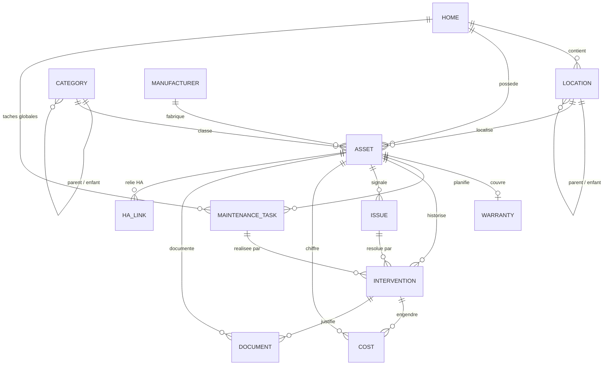

# Modèle de données — MaBarak

Ce document décrit le modèle de données de l'application. Le schéma SQL exécutable et commenté
est dans [schema.sql](schema.sql), qui fait référence. Les décisions structurantes sont
justifiées dans [adr/](adr/).

Ce modèle doit être **validé avant tout développement métier**, comme demandé par le cahier des
charges.

## 1. Vue d'ensemble



Onze tables, une table de liaison Home Assistant, deux vues dérivées. Toutes les dates sont stockées en `TEXT` au format ISO 8601,
convention SQLite ; les dates seules sont en `YYYY-MM-DD` et les horodatages en
`YYYY-MM-DDTHH:MM:SSZ` (UTC).

## 2. Tables

### 2.1 `home`

La maison. Une seule ligne est exposée en V1, mais la table existe pour ne pas avoir à
introduire une clé étrangère partout plus tard si le multi-maisons devient nécessaire.

Champs notables : `name`, `address`, `currency` (par défaut `EUR`),
`due_soon_threshold_days` (nombre de jours en dessous duquel une échéance passe en
« bientôt », par défaut 30).

`address` est facultatif et n'est jamais transmis nulle part. Il n'existe que pour le confort de
l'utilisateur.

### 2.2 `location`

Arborescence des lieux, par auto-référence sur `parent_id`. Un niveau quelconque de profondeur
est permis, ce qui couvre les exemples du cahier des charges (`Maison > Rez-de-chaussée >
Cuisine`) comme les cas plats (`Jardin`).

`location_type` prend les valeurs `building`, `floor`, `room`, `zone`, `outdoor` ou
`technical`. Ce champ est purement indicatif : il sert à choisir une icône et à grouper
l'affichage, jamais à contraindre la hiérarchie. Un utilisateur doit pouvoir organiser sa maison
comme il l'entend.

`sort_order` permet un ordre d'affichage explicite plutôt qu'alphabétique.

La suppression d'un lieu est en `ON DELETE RESTRICT` : il faut d'abord déplacer ou supprimer ce
qu'il contient. Perdre silencieusement la localisation d'un équipement serait une régression de
données inacceptable.

### 2.3 `category`

Catégories d'équipements, également hiérarchiques : `Chauffage > Pompe à chaleur`. Les
catégories du cahier des charges (section 7) sont pré-alimentées avec `is_builtin = 1` ;
l'utilisateur peut en créer d'autres, qui auront `is_builtin = 0`.

Les catégories intégrées ne sont pas supprimables mais peuvent être masquées via
`is_hidden`. Cela évite qu'une mise à jour de l'application ne recrée des catégories que
l'utilisateur avait volontairement retirées.

### 2.4 `manufacturer`

Fiche constructeur mutualisée entre plusieurs équipements : `website_url`, `support_url`,
`support_phone`, `documentation_url`, `parts_url`. La section 16 du cahier des charges distingue
les liens génériques du constructeur (ici) des liens propres à un équipement, qui sont stockés
sur `asset`.

### 2.5 `asset`

Table centrale. Elle représente à la fois les équipements et les éléments de construction, via
le discriminant `kind` valant `equipment` ou `building_element`. Le raisonnement est détaillé
dans [adr/0001](adr/0001-table-asset-unique.md) : les deux natures d'objets partagent
exactement les mêmes satellites (entretiens, interventions, documents, coûts, localisation), et
les séparer obligerait à dupliquer six relations et toute la logique d'échéances.

Champs communs : `name`, `kind`, `category_id`, `location_id`, `status`, `notes`.

Champs propres aux appareils, tous nullables : `manufacturer_id`, `brand`, `model`,
`reference`, `serial_number`, `purchase_date`, `install_date`, `manual_url`, `support_url`,
`parts_url`.

`status` prend les valeurs `planned`, `active`, `inactive` ou `removed`. Un équipement retiré
reste dans la base : son historique et ses coûts font partie de l'histoire de la maison, ce qui
est le principe fondamental du projet.

`brand` coexiste avec `manufacturer_id` volontairement : beaucoup d'équipements seront saisis
rapidement avec une simple marque en texte libre, sans que l'utilisateur ait envie de créer une
fiche constructeur complète. La fiche peut être créée plus tard et rattachée.

Le rattachement à Home Assistant n'est **pas** une colonne sur `asset`. Voir
[2.12 `ha_link`](#212-ha_link).

### 2.6 `warranty`

Relation un-à-un avec `asset` (`asset_id` unique). Champs : `start_date`, `duration_months`,
`provider`, `terms_url`, `notes`.

`end_date` est une **colonne générée** calculée par SQLite :

```sql
end_date TEXT GENERATED ALWAYS AS (
    CASE WHEN duration_months IS NULL THEN NULL
         ELSE date(start_date, '+' || duration_months || ' months')
    END
) VIRTUAL
```

C'est la traduction directe de la section 17 (« date de fin calculée automatiquement »). Une
colonne générée garantit que la date de fin ne peut jamais dériver de la durée saisie, ce qu'une
colonne classique maintenue par l'application ne garantit pas. La colonne est `VIRTUAL` et non
`STORED` : elle est donc indexable en SQLite, mais recalculée à la lecture, sans coût de
stockage.

`start_date` correspond au point de départ réel de la garantie, qui n'est pas toujours la date
d'achat : certains constructeurs la font courir à partir de l'installation. L'application
propose la date d'achat par défaut et laisse l'utilisateur corriger.

### 2.7 `maintenance_task`

Tâches d'entretien récurrentes ou ponctuelles.

`asset_id` est **nullable**. Une tâche sans équipement est une tâche de maison
(« ramoner la cheminée », « vérifier les détecteurs de fumée »), rattachée à `home_id`. Une
contrainte `CHECK` impose qu'exactement l'un des deux soit renseigné.

Champs de planification :

- `recurrence_type` : `none`, `days`, `months`, `years`, `annual_fixed` ou `custom_date`
- `recurrence_interval` : le X de « tous les X jours/mois/ans »
- `recurrence_anchor` : `from_completion` ou `from_due_date`
- `fixed_month` / `fixed_day` : pour `annual_fixed` (« chaque année le 15 janvier »)
- `custom_due_date` : pour `custom_date`
- `last_completed_on` et `next_due_on`
- `lead_time_days` : surcharge locale du seuil « bientôt » de la maison
- `priority` : `low`, `normal`, `high` ou `critical`
- `is_active`

`recurrence_anchor` est le champ le plus important du modèle et la raison d'un ADR dédié
([adr/0004](adr/0004-ancrage-de-recurrence.md)). Il distingue deux comportements que le cahier
des charges ne mentionne pas explicitement mais qui sont tous deux nécessaires :

- `from_completion` : la prochaine échéance part de la date réelle de réalisation. Un nettoyage
  de filtres fait avec deux semaines de retard décale d'autant le suivant.
- `from_due_date` : la prochaine échéance part de la date théorique. Un entretien annuel
  contractuel reste dû à la même période de l'année, même s'il a été réalisé en retard.

Sans cette distinction, un entretien réglementaire finirait par dériver de plusieurs mois au
bout de quelques années.

`next_due_on` est une **dénormalisation assumée** : la valeur est recalculée par la couche
service à chaque validation d'entretien et à chaque modification de la planification. Elle est
indexée, car le tableau de bord et l'endpoint `/api/ha/summary` la trient et la filtrent à
chaque appel du coordinator Home Assistant. La recalculer à la volée à chaque requête serait
inutilement coûteux.

### 2.8 `intervention`

Toute action datée réalisée sur un équipement : entretien, réparation, installation,
inspection, remplacement. C'est la table qui alimente l'historique.

`intervention_type` : `maintenance`, `repair`, `installation`, `inspection`, `replacement` ou
`other`.

`task_id` est nullable : une intervention peut découler d'une tâche planifiée
(bouton « entretien effectué ») ou être saisie librement. `issue_id` est nullable également,
et relie une intervention au problème qu'elle traite.

Champs : `performed_on`, `performed_by` (texte libre : « moi », « Dupont Chauffage »),
`notes`, `created_at`. Les coûts et les documents associés sont dans leurs tables respectives,
reliés par `intervention_id`.

### 2.9 `issue`

Problèmes et réparations de la section 12. Champs : `title`, `description`, `action_taken`,
`result`, `status` (`open`, `in_progress`, `resolved`), `severity`, `opened_on`,
`resolved_on`.

`resolved_on` doit être renseigné si et seulement si `status = 'resolved'`, garanti par une
contrainte `CHECK`.

### 2.10 `cost`

Dépenses de la section 18. `cost_type` : `purchase`, `installation`, `maintenance`, `repair`,
`parts`, `subscription` ou `other`.

`amount_cents` est un **entier en centimes**, pas un flottant. Additionner des flottants pour
produire un total affiché à l'utilisateur introduit des erreurs d'arrondi visibles ; le cahier
des charges affiche explicitement un total par équipement.

`intervention_id` est nullable. Quand l'utilisateur saisit un coût au moment de valider un
entretien, une seule ligne est créée et rattachée à l'intervention : pas de double saisie, et le
coût reste visible depuis les deux entrées. Voir
[adr/0003](adr/0003-historique-derive.md) pour le raisonnement complet sur cette non-duplication.

`currency` est stockée par ligne, avec la devise de la maison par défaut, pour ne pas corrompre
les historiques si l'utilisateur change de devise.

### 2.11 `document`

Documents de la section 13, avec les trois modes de stockage de la section 14.

`doc_type` : `invoice`, `manual`, `user_guide`, `certificate`, `warranty`,
`service_contract`, `photo` ou `other`.

`storage_mode` détermine laquelle des trois colonnes de contenu est utilisée :

- `local_file` : `file_path` relatif à `/data/documents/`, avec `file_size` et `mime_type`
- `external_link` : `url` vers Nextcloud, Drive, OneDrive, un NAS ou autre
- `reference_note` : `reference_note`, texte libre du type « e-mail du 12/05/2024 » ou
  « classeur chauffage au garage »

Une contrainte `CHECK` impose la cohérence entre `storage_mode` et la colonne renseignée. Le
raisonnement, et pourquoi trois tables séparées auraient été une erreur, sont dans
[adr/0002](adr/0002-document-a-trois-modes-de-stockage.md).

**Rattachement.** Un document est rattaché à exactement une entité, via l'une des clés
étrangères nullables `home_id`, `asset_id`, `maintenance_task_id`, `intervention_id`,
`issue_id`, avec une contrainte `CHECK` d'exclusivité. Une table de liaison polymorphe aurait
permis les rattachements multiples, mais au prix de la perte de l'intégrité référentielle : un
document orphelin après suppression d'un équipement est exactement le genre de perte silencieuse
que ce projet doit éviter. Une facture rattachée à une intervention reste de toute façon
accessible depuis l'équipement par jointure.

`is_primary_photo` marque la photo principale d'un équipement. La contrainte d'unicité est
partielle : au plus une photo principale par `asset_id`.

### 2.12 `ha_link`

Liaison d'une fiche `asset` à un appareil et/ou à des entités Home Assistant. Voir
[adr/0006](adr/0006-liaison-aux-appareils-home-assistant.md). Cette table existe dans le schéma
dès maintenant ; la V1 ne l'écrit pas.

`link_kind` vaut `device` (cas normal : un robot, une pompe à chaleur connectée) ou `entity`
(entité isolée, ou consommable d'un appareil déjà lié).

La clé stockée est l'UUID du registre Home Assistant (`ha_device_id` ou
`ha_entity_registry_id`), pas l'`entity_id` renommable. `name_at_link`, `entity_id_at_link` et
`domain_at_link` sont des instantanés : si l'intégration source disparaît, la fiche affiche
encore « Roborock S8 salon » avec un statut `missing`, au lieu d'un identifiant mort.

`role` distingue `primary`, `command`, `consumable`, `diagnostic` et `other`.
`consumable_kind` n'est renseigné que pour un consommable (`filter`, `main_brush`,
`side_brush`, `sensor`, `other`). C'est ce qui permettra, en V4, de relier une tâche
« remplacer le filtre » au capteur d'usure réel plutôt qu'à un calendrier supposé.

`resolution_status` vaut `ok`, `missing` ou `unresolved`. `last_resolved_at` date la dernière
confirmation réussie dans le registre.

Contraintes : un appareil HA et une entité HA ne se rattachent qu'à une seule fiche ; une
fiche n'a qu'un lien `primary`.

## 3. Vues dérivées

### 3.1 `v_asset_timeline`

L'historique de la section 11 est une **vue**, pas une table. Elle unifie par `UNION ALL` :

- la date d'installation de l'équipement ;
- les interventions ;
- l'ouverture et la résolution des problèmes ;
- les coûts qui ne sont rattachés à aucune intervention ;
- la fin de garantie.

Le raisonnement est dans [adr/0003](adr/0003-historique-derive.md) : une table `history`
alimentée en parallèle des tables métier serait une double écriture, donc une source de
désynchronisation permanente. Une vue est par construction toujours cohérente.

Colonnes : `asset_id`, `event_type`, `occurred_on`, `title`, `detail`, `amount_cents`,
`source_table`, `source_id`.

### 3.2 `v_task_status`

Statut dérivé de chaque tâche, en appliquant le seuil « bientôt » :

- `overdue` si `next_due_on < date('now')`
- `due_soon` si l'échéance est dans les `lead_time_days` jours
- `ok` sinon
- `unscheduled` si `next_due_on` est nul

Cette vue est la source unique du tableau de bord (section 19) et du contrat
`/api/ha/summary`. Les couleurs de l'interface et les états des capteurs Home Assistant
dérivent donc des mêmes valeurs, ce qui évite qu'ils divergent.

## 4. Intégrité et suppressions

Les règles de suppression sont choisies pour ne jamais perdre d'historique silencieusement :

- `RESTRICT` sur `location`, `category`, `manufacturer` : il faut traiter les dépendances
  explicitement.
- `CASCADE` depuis `asset` vers ses satellites (`warranty`, `maintenance_task`,
  `intervention`, `issue`, `cost`, `document`, `ha_link`) : supprimer un équipement supprime tout ce qui le
  concerne, ce qui est le comportement attendu, mais l'interface devra le confirmer clairement et
  privilégier le passage en `status = 'removed'`.
- `SET NULL` de `intervention` vers `cost` et `document` : supprimer une intervention par erreur
  ne doit pas effacer la facture.

`PRAGMA foreign_keys = ON` est obligatoire à chaque connexion : SQLite ne l'active pas par
défaut, et sans lui aucune de ces règles ne s'applique.

## 5. Correspondance avec le cahier des charges

- Section 4 et 26, structure générale : `home`, `location`, `asset`, `maintenance_task`,
  `intervention`, `document`, plus la vue `v_asset_timeline`
- Section 5, gestion des lieux : `location` auto-référencée
- Section 6, fiche équipement : `asset`
- Section 7, catégories : `category`, hiérarchique, pré-alimentée et extensible
- Section 8, éléments de construction : `asset` avec `kind = 'building_element'`
- Section 9, entretiens et fréquences : `maintenance_task`
- Section 10, validation d'un entretien : `intervention` plus `cost` et `document` liés
- Section 11, historique : vue `v_asset_timeline`
- Section 12, problèmes : `issue`
- Sections 13 et 14, documents et confidentialité : `document` et ses trois modes
- Section 15, recherche de manuels : `asset.manual_url` et `manufacturer.documentation_url`
- Section 16, constructeurs : `manufacturer` plus les liens propres sur `asset`
- Section 17, garanties : `warranty` et sa colonne générée `end_date`
- Section 18, coûts : `cost` en centimes
- Sections 19 et 20, tableau de bord et calendrier : vue `v_task_status`
- Sections 21 et 22, notifications et entités : contrat `/api/ha/summary`
- Liaison aux appareils Home Assistant (hors V1, schéma dès maintenant) : `ha_link`
- Section 23, QR codes (V2) : `asset.id` suffit, aucun champ à ajouter
- Section 24, photos : `document` avec `doc_type = 'photo'` et `is_primary_photo`
- Section 25, recherche globale : index FTS à ajouter en V1, non encore modélisé

## 6. Points ouverts

- **Recherche globale.** La section 25 demande une recherche transverse. Une table virtuelle
  FTS5 alimentée par triggers sur `asset`, `document`, `intervention` et `issue` est la solution
  la plus simple en SQLite. À spécifier avant l'implémentation de la V1.
- **Multi-maisons.** La table `home` existe et les clés étrangères sont en place, mais
  l'interface n'expose qu'une maison. Aucune migration ne sera nécessaire pour l'activer.
- **Liaison Home Assistant.** Le schéma est prêt (`ha_link`). L'interface de rattachement
  manuelle est prévue en V2 ; l'exploitation des capteurs d'usure pour déclencher un entretien
  est prévue en V4. Voir [adr/0006](adr/0006-liaison-aux-appareils-home-assistant.md).
- **Volumétrie des documents locaux.** Les sauvegardes natives de Home Assistant incluent
  `/data`. Si des utilisateurs y stockent beaucoup de PDF, les sauvegardes grossiront
  proportionnellement. À surveiller, éventuellement en proposant une option d'exclusion.
